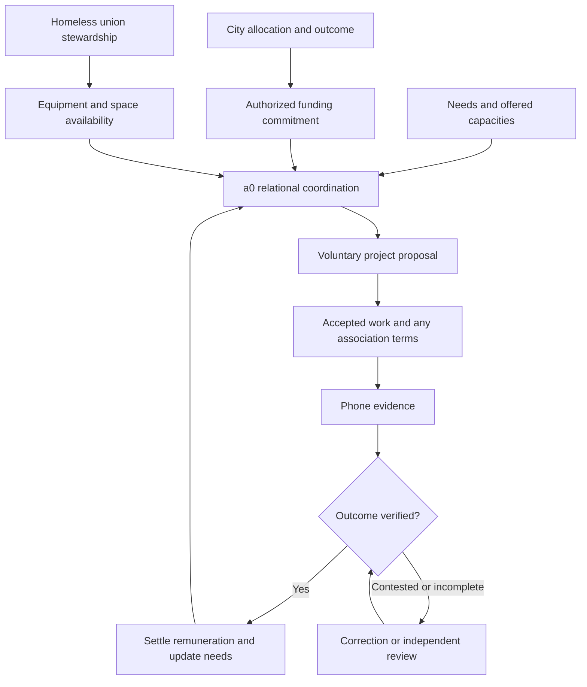
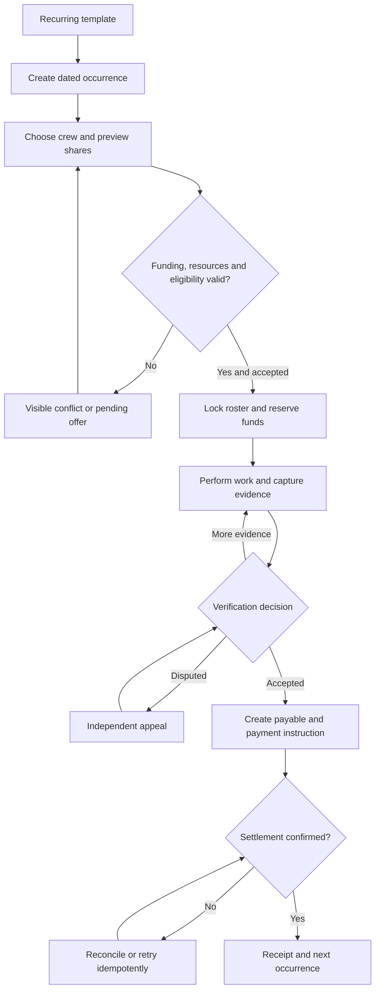
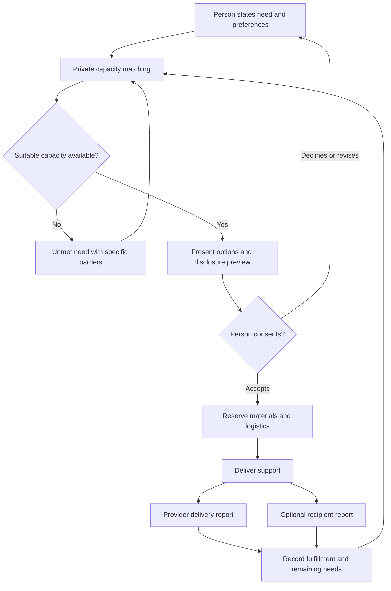
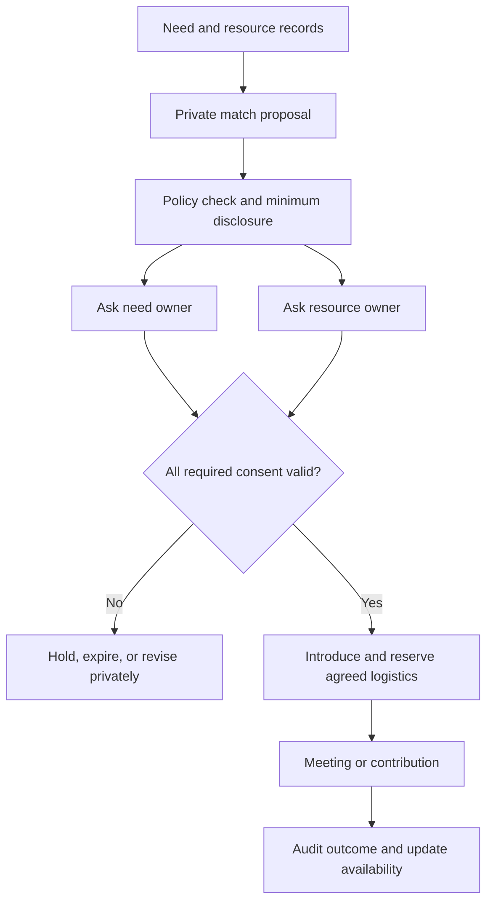
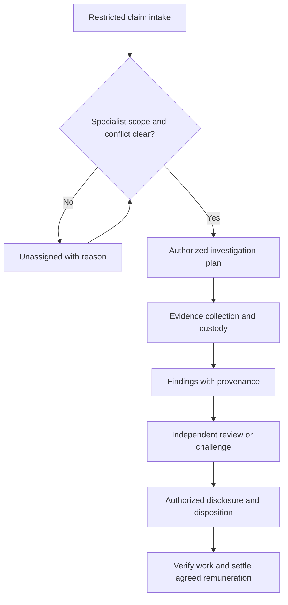
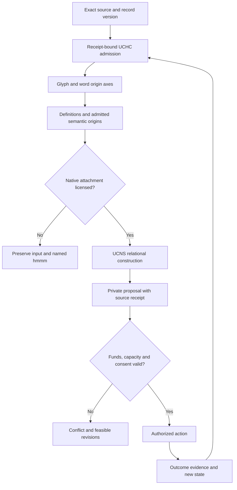
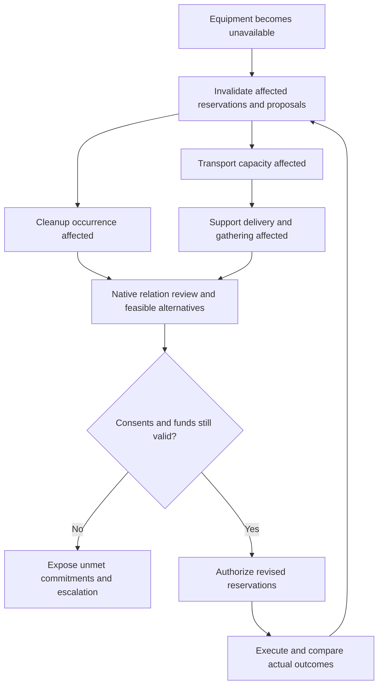

# a0 Municipality — implementation handoff

Version 1.1 · 2 October 2026 · Prepared for Erin Spencer / The Interdependency

**Revision:** incorporates the user's v1.0 audit, with the accounting, authority and record-placement refinements documented in §16. U01–U14 retain their original wording. This revision adds P37 and T31–T38; it does not promote any unresolved producer or operational authority to settled status.

**Purpose:** build a phone-first municipal coordination application that connects tax-funded obligations, voluntary remunerative contribution, equipment stewardship, material support, and durable-needs fulfillment. The intended organizing mechanism is UCNS relational geometry with UCHC origin sets for database affixiation and semantic relationing.

**Status:** implementation specification, not an implemented app or proof of concept. User decisions below are controlling requirements. Provisional answers are explicit engineering proposals, not attributed to the user. Repository observations are bounded to the source identities in §15. No partner, allocation, property, payment facility, or equipment donation has been secured by this document.

## 1. Instructions to the receiving builder

Read this entire handoff, current skill-lib instructions, and the governing repository files before editing. Recheck the exact source identities in §15 and preserve their authority boundaries. Reuse existing a0 contracts for resource/need matching, consent, memory, and agent runtime. Consume UCNS and UCHC construction; never invent a replacement because a familiar implementation is easier.

Build the complete interacting application described here. Sequence the work to manage resources, but do not redefine the deliverable as one cleanup transaction, a CRUD board, an embedding search, or a visualization. A staged implementation remains incomplete until its remaining obligations are fulfilled or precisely reported as blocked.

Use the provisional answers in §3 to proceed without repetitive questions. A provisional answer can be changed with a versioned decision record and impact analysis. Do not invent municipal authority, partner consent, a payment entitlement, or a missing geometric law. Isolate the unavailable boundary and continue useful unaffected work. Keep unresolved mechanics as named `hmmm` records, not silent defaults.

The requested deliverable from this conversation is this handoff. It does not itself authorize sending invitations, making payments, signing agreements, leasing property, merging branches, or deploying public access.

## 2. Controlling user decisions and scope

| ID | Decision to preserve |
|---|---|
| U01 | An individual municipal employee must be able to inspect the financial underpinnings, allocations, obligations, and blockages behind city work. |
| U02 | The app is a bounty board for municipal psychosociophysiological infrastructure maintenance and durable-needs fulfillment. |
| U03 | Oakland Homeless Union and Berkeley Homeless Union are the intended union partners. Unhoused people are central workers and material stewards. Do not substitute a municipal employees' union. |
| U04 | Proposed equipment donation goes to the relevant homeless union, which assumes maintenance and keeping. The exact assets and donor remain subject to actual agreement. |
| U05 | The city supplies project allocations and specifies what accomplishment looks like. “Taxes paid” means tax revenue is the source of funding. It does not mean payout tax obligations have been settled. |
| U06 | Participants choose association relations and reserve repeatable remunerative workflows. |
| U07 | Phone evidence supports verification and monetized remuneration. |
| U08 | At the cleanup assignment scale, remuneration can replicate up to four base bounties; a fifth participant divides that four-bounty total among five. Five is the ceiling for this assignment scale, not a universal limit. |
| U09 | Include daily cleanup; voluntary trauma-aware interaction and water/food/shelter support; meet-and-greet need/capacity/logistics matching; registered-specialist investigation of theft and coercive violence claims. |
| U10 | a0 researches the project set and builds dynamic holographic relations among city structures, population sets, psychosociophysiological fauna, and their durable needs in a UCNS city tensor. |
| U11 | Use UCNS relational geometries and UCHC origin sets for database affixiation and semantic relationing. Glyphs compose into words; completed words participate as axes at higher scales. |
| U12 | A realistic proof of concept is a six-month funded deployment with nontrivial expenditure. A hackathon demonstration cannot establish that proof. |
| U13 | Prize money is the minimum starting resource; the maximum six-month planning spend is $8,000,000. Property rental is the principal cost driver. |
| U14 | Apply existing Stack provisions for consent, repair, accountability, privacy, verification, and authority. Do not repeatedly reintroduce settled architecture as unanswered questions. |

Use case five was started but never specified. Reserve the slot; do not invent its contents.

### 2.1 Meaning-bearing terms

These are application-scoped definitions, not amendments to producer canon.

| Domain-qualified term | Operative meaning | Excluded conflation |
|---|---|---|
| `municipality.bounty` | Versioned remunerative offer for a specified contribution/outcome with funding and verification terms. | Vigilante reward, policing authority, unconditional proof of funding. |
| `municipality.worker` | A person voluntarily performing an admitted contribution. | Software agent; presumed employment or contractor classification. |
| `municipality.union` | The participating Oakland or Berkeley homeless union organization. | SEIU substitution; assumed agreement to participate. |
| `municipality.association` | Purpose-scoped, voluntary collaboration with inspectable terms and withdrawal. | Universal membership, forced assignment, permanent affiliation. |
| `municipality.city_tensor` | Desired composition of municipal need/capacity/structure relations using source-qualified UCNS/UCHC constructions. | Merely calling SQL rows or an arbitrary numerical array a tensor. |
| `municipality.database_affixiation` | Constitutive attachment of admitted, closed constructions to exact database facts and each other under an owned construction profile. | A foreign key or join alone; a UUID treated as a gonol. |
| `municipality.holographic_recovery` | Candidate recovery of a frozen whole-property from declared relationally partial views with independent origins. | Full-data retrieval, cached answers, copied payloads, or decorative geometry. |

METAPAT's `Vector`, a mathematical Hilbert state vector, a UCNS displacement vector, and a map direction remain separately qualified. Ordinary operational geography uses physical coordinates; those coordinates do not become the semantic basis.

## 3. Most probable answers to questions not yet asked

**P = provisional:** implement as the documented default where reversible; expose the setting or decision record. **H = unresolved authority or producer law:** implement the boundary and its failure behavior, not an invented answer.

| ID | Question | Most probable answer / action | Standing |
|---|---|---|---|
| P01 | What device and distribution? | Mobile web app/PWA usable in Android Chrome, with camera/file input and install-to-home-screen. No app-store account required for the first delivery. | P |
| P02 | Which runtime? | A separately configured municipality deployment/profile of a0, reusing its Express/React/FastAPI composition and native metadata-driven console. Keep its data and finances separate from the public a0p instrument. | P |
| P03 | Where does code belong? | App routes/services/UI in a0; language construction in its current Stack forge/UCHC migration path; geometry in UCNS; municipal composition experiments in a proposed Stack research workspace. Do not put municipal semantics in UCNS. | P |
| P04 | One or both cities? | Model Oakland and Berkeley from day one as separate jurisdictions; activate real operations only where agreements exist. Neither city automatically guarantees the other's commitments. | P |
| P05 | Who can participate? | Adults who opt in, including unhoused people and allies; union membership and eligibility for an assignment are separate facts. Pilot enrollment is voluntary; public browsing does not require identity documents. P37 defines the adult-eligibility evidence boundary. | P |
| P06 | How do people sign in? | Reuse verified a0 identity/session boundaries; support a public alias and recovery through a verified contact or assisted union process. Do not make permanent address or ownership of a phone a participation prerequisite. | P |
| P07 | What is the union's governance? | Import each organization's actual delegated roles and decisions. The app records stewardship and authority; it does not write the union's constitution. | H |
| P08 | How is municipal financial data acquired? | Source-linked manual entry and CSV/document import first; add authorized read-only municipal API adapters when available. Preserve original rows/pages and extraction uncertainty. | P |
| P09 | Can a budget line fund a job immediately? | No automatic conversion. A named authority must admit spending authority to the app; an assignment then requires an authorized commitment. Proposed, appropriated, committed, payable, and paid are distinct lifecycle terms, mapped to the fund partition in §6.2. | P |
| P10 | Who verifies? | A named verifier authorized for the assignment and independent of its claimants; retain affected-person feedback and a separate appeal route. Support specialist or union verification where delegated. | P |
| P11 | How is the base bounty set? | A versioned amount set in the funded offer by its authorized issuer, informed by scope and required capacity. Never infer a wage or price from a person's housing status. | P |
| P12 | What does division versus replication mean? | Two explicit assignment policies: divide a fixed pool, or replicate a base amount up to four shares. Use capped replication for the user's cleanup example. See §6. | P; replication shape follows U08 |
| P13 | When can a fifth person join? | Before roster lock, after everyone sees and accepts the resulting shares. Reopening a roster requires new consent; do not reduce an already-earned entitlement retroactively. | P |
| P14 | Can somebody reserve six months of work? | They can express recurring preference. Only a visible rolling funded horizon becomes a firm reservation; provisional future occurrences carry no payment promise. | P |
| P15 | How is work divided? | Participants propose roles and share allocations within the funded policy; equal division is the default. Specialist requirements remain assignment-specific. | P |
| P16 | What if a participant leaves? | Release unused capacity, replan with consent, and settle separately verified completed portions under predeclared terms. Preserve accepted claims; never erase earned pay by canceling the series. | P |
| P17 | What is the initial payment method? | Payer-authorized payment batches/export and imported settlement confirmation. Add a provider adapter later. An API response or approval alone is not paid status. | P |
| P18 | What about employment, tax reporting, and insurance? | Record the actual payer and engagement arrangement; require its validated onboarding/coverage policy for the live assignment. Do not assume self-employment, union employment, exemption, or that “taxes paid” settles this. | H |
| P19 | Does basic support require work? | Support requests remain available independently of bounty participation. A person can receive support, offer capacity, or do both. | P, consistent with existing agency/repair contract |
| P20 | How are trauma-related needs expressed? | Person-authored preferences, triggers they choose to disclose, access needs, and desired contact. No automated trauma diagnosis, capture score, or behavioral conformity reward. | P, source-bound PSFR constraint |
| P21 | What is rented property for? | Candidate uses include stable space for support, gatherings, equipment/material storage, work, and shelter where suitable. Keep each use and capacity separately costed; the user has not fixed the property program. | P/H |
| P22 | Do we require GPS, faces, or constant tracking? | No. Capture task evidence and an optional location/time attestation; allow witness/manual alternatives. No continuous participant tracking or biometric enrollment by default. | P |
| P23 | What counts as evidence? | Original media/document, source identity, capture and receipt times, assignment scope, attestations, and verification decision. Hashing proves byte integrity, not truth. | P |
| P24 | Does offline mode finalize reservations or payments? | No. Offline mode stores encrypted/appropriately protected drafts and pending uploads; the server confirms scarce-resource reservations and financial commitments. | P |
| P25 | How are contested conclusions handled? | Preserve allegation, observation, model proposal, verification, challenge, and adjudication as separate source-bearing records. | P |
| P26 | Can a0 see across private owners? | Follow the existing innkeeper contract: designated system primary may process extant platform memory for allowed purposes; child/user agents receive scoped projections; disclosure has separate permission. | Existing a0 design contract; enforcement needs live evidence |
| P27 | Does cross-city inference permit cross-city disclosure? | No automatic disclosure. One platform primary can process authorized internal records; each municipality, union, user, and external provider sees only its permitted projection. | P applying source contract |
| P28 | What database? | PostgreSQL for transactional facts, permissions, money, events and indexes; immutable object storage for evidence/construct artifacts; retain the verified UCHC corpus in its native artifact form. | P |
| P29 | What is the SQL migration authority? | Prefer the settled backend-foundation SQLAlchemy/Alembic target. Inspect current Drizzle consumers first; migrate compatibly with exactly one schema writer. Source files conflict on current implementation. | P; reconciliation required |
| P30 | Can embeddings or a graph replace UCHC? | No. They may be explicitly labeled comparison/retrieval tools if useful, never construction identity or proof of native semantic relationing. | Required boundary |
| P31 | What are record-level semantic origins? | Each record/version/domain retains a distinct attachment context referencing native origin-qualified constructions. Whether it closes into a new semantic-origin gonol must be supplied by the owning producer profile. | H on native promotion law |
| P32 | Which Hilbert scalar field and cross-origin similarity? | Neither is silently selected. Preserve explicit R/C choice when an operator needs it; unlicensed cross-origin inner products remain unavailable. | H in producer |
| P33 | What if inference is unavailable or quota exhausted? | Preserve work, evidence, funds, and queues; show proposals as pending. Do not reclassify rule-based/manual results as native inference. Never let a model failure change a financial entitlement. | P |
| P34 | Which fifth workflow? | Unspecified. Reserve a typed extension point; ship the four specified workflows without claiming a fifth exists. | H |
| P35 | How long is evidence retained? | Make schedules data-class/payer/consent specific. Establish them before live sensitive enrollment; support redaction, tombstones, hold exceptions and verified deletion. Do not hard-code an invented legal duration. | H |
| P36 | How much should the first build cost? | Use existing verified compute/credits where available, one deployment and bounded provider calls. Do not purchase capacity from a remembered credit balance. Instrument actual costs and budget admission. | P |
| P37 | How is adult eligibility verified? | Record an attested age declaration at enrollment, separately from verified eligibility. Require government-ID or union-assisted verification only where the validated payer/coverage policy demands and accepts that method. Browsing requires no ID. Do not infer age from housing status, appearance or other proxy traits. | P; policy requirements and accepted verification methods remain H until validated |

These answers are a decision queue, not a request that Erin answer 37 questions. Escalate only a consequential choice that the sources, reversible defaults, or explicit boundary cannot resolve.

## 4. Product surfaces and authority

### 4.1 Minimum useful screens

| Screen | Primary action | Essential visible state |
|---|---|---|
| My day | View/reserve today's work and support; resume evidence capture. | Confirmed versus pending; expected remuneration; chosen associates; access/logistics requirements. |
| Work board | Inspect offers and choose recurring work. | Scope, funding state, amount, share policy, equipment, location, time, verifier, eligibility. |
| Needs and offers | Request water/food/shelter/support or offer resources/capacity. | Disclosure scope, available quantity/time, expiry, contact preference; withdrawal. |
| Associations | Create a crew or accept a specific introduction. | Each person's consent, roles, share preview, recurrence, withdrawal effect. |
| Evidence | Capture/import and submit proof. | Upload progress, source/capture status, missing criteria, receipt and challenge history. |
| Equipment and space | Reserve, check out, maintain, and return resources. | Owning union, condition, training requirements, booking conflicts, available capacity. |
| Municipal desk | Trace funds and obstacles; authorize permitted actions. | Source document, extraction status, allocations, holds, obligations, payments, unmet outcomes. |
| Review and cases | Verify work or handle a specialist case within scope. | Evidence, permission, conflicts, decision reasons, appeal; no public claimant dossier. |
| Relations | Inspect native need/capacity/financial relations and change effects. | Exact producer/source provenance, operational state, candidate status, blocked relations. |

“My day” is a composed view over confirmed occurrences, support commitments, evidence drafts and pending associations. It owns no new durable state; its actions invoke the owning workflow commands.

Use native `UI_META` and `DATA_SCHEMA` owners to generate navigation, forms and permissions. Keep routine participant language plain; place producer details in an expandable evidence view. Both graph and list views must expose the same admitted relations; a drawing never adds authority.

### 4.2 Roles

Participant, assisted participant delegate, support provider, union steward, equipment/property steward, municipal allocator, verifier, payer/reconciler, registered specialist, auditor, and system-primary are separate permissions scoped by purpose and organization. A donor identity is recorded as a source/issuer, not as a participant role or an automatic permission grant. One person may hold several roles; each action records which role was exercised. Block self-verification of a remuneration claim. Specialist registration includes scope, issuer, expiry, current standing and conflicts, not a free-text badge.

Support providers may record delivery; recipients can acknowledge, correct or dispute. Missing acknowledgement is not automatically a refusal or failed service. Unavailable suitable support is recorded as unmet need, not participant noncompliance.

Equipment/property stewards record condition, maintenance, checkout and return under the recorded union stewardship delegation and applicable property-use rights. A steward role does not transfer legal ownership, including ownership of rented property.

### Diagram 1 — funding, stewardship, and work

## 5. Operational workflows

### 5.1 Recurring cleanup

Create a recurring template with a precise work area, definition of done, waste categories, disposal destination, necessary equipment and access, funding, base bounty and roster policy. Each occurrence has its own identity, booking, evidence, and financial hold. A template is not permission to spend an unlimited future series.

Show the participant and associates the full remuneration preview before acceptance. Confirm a roster only after atomic funding, equipment/space and assignment-eligibility checks, including the applicable validated payer onboarding/coverage policy. Workers capture before/after evidence and required disposal evidence; original uploads remain private to permitted viewers. Cleanup scope must distinguish waste from residents' belongings; the assignment grants no authority to remove a person or destroy property. This is a work specification requirement, not an AI classification of abandonment.

### Diagram 2 — recurrence, evidence, and settlement

### 5.2 Support and durable-needs fulfillment

A person or authorized helper records a need in their own terms. Assistance does not require disclosing a trauma history. Capture the operational constraints the person wants honored: contact style, quiet space, physical access, animals, storage, transport, timing, companions, food/water requirements. Capacity is specific and time-bound; an available bed is not automatically a suitable placement.

Offer alternatives with reasons, identify missing requirements honestly, and preserve consent and withdrawal. Deliver materials or interaction, record the recipient's account separately from provider evidence, and update which needs remain unmet. Payment may remunerate providers under a funded offer; receiving support does not itself create a debt or work obligation.

### Diagram 3 — support with genuine choice

Provider and recipient reports are separate records. An absent recipient report remains absent; it neither blocks recording a provider account nor becomes a refusal or noncompliance finding. Fulfillment standing still follows the declared verification criteria.

### 5.3 Meetings, introductions, and logistics

Treat a meet-and-greet as a funded project with place/time/capacity, accessible transport, materials, host duties, and participant preferences. Resources may be ephemeral: a free vehicle for two hours, spare food before expiry, a specialist's available afternoon. A private offer or need does not become a public directory entry.

Follow the existing a0 introduction contract: private candidate, separate consent requests, exact disclosure previews, grants bound to fields/purpose/expiry, introduction, outcome audit. Refusal or timeout changes the match state without revealing the other party. Recheck both grants immediately before disclosure. Invitations to an event and permission to share someone's identity are separate.

### Diagram 4 — private introduction

### 5.4 Registered-specialist investigations

Receive an allegation with restricted evidence and the claimant's disclosure preferences. Assign only within independently verified specialist scope, with conflict checks and a named commissioning authority. Registration alone grants neither police powers nor access to every record. Preserve allegation, observed evidence, inference, finding, response, and review separately. Payment is for agreed investigative work, never for producing an accusation or a preferred verdict.

The case can expose a financial irregularity or coercive activity without publishing a private person's location. Return actionable findings to the authorized recipient; route requests beyond the specialist's scope to the responsible authority. Include an immediate assistance/referral path when needed, without pretending the app is an emergency response service.

### Diagram 5 — specialist case

## 6. Remuneration, budgets, and reservations

### 6.1 Capped replication policy

For positive integer participant count `n`, where `1 <= n <= 5`, and base bounty `B` expressed in currency minor units:

`pool = B * min(n, 4)`

Equal division is the provisional default. Use integer minor units and a deterministic largest-remainder rule, with a recorded rotation for extra cents across recurring occurrences. Never round away or create money. Reject booleans, fractions, zero, negative or greater-than-five participant counts for this assignment scale.

| Participants | Pool | Equal share at example B = $100 |
|---:|---:|---:|
| 1 | B | $100 |
| 2 | 2B | $100 |
| 3 | 3B | $100 |
| 4 | 4B | $100 |
| 5 | 4B | $80 |

The $100 amount is arithmetic illustration, not a suggested rate. Four shares is the total cap, not four additions to an original fifth share. Crew expansion is conditional on funding. Show the 4-to-5 change before anyone consents. Separate `fixed_pool_division` from `capped_replication`; a policy change creates a new offer revision.

### 6.2 Accounting contract

Maintain an append-only journal with balanced postings and explicit fund restrictions. A budget document is evidence of an appropriation, not possession of cash. Record both spending authority and cash availability where relevant. Each hold/payable/settlement names its city, fund, source authorization, project occurrence, policy version, and recipients.

Per allocation, reconcile these mutually exclusive financial states:

`authorized_amount = available + reserved + payable + settled_net + returned`

Use this as an application reconciliation partition, separate from general-ledger account definitions. Evaluate one currency, allocation and authorization version at each durable checkpoint; all buckets are nonnegative integer minor units. `available` is admitted authority remaining for eligible commitments, `reserved` backs authorized work not yet payable, `payable` is an accepted unpaid obligation, `settled_net` is net confirmed settlement, and `returned` is value retired from that authorization and unavailable for reuse. The partition measures disposition of authority; it is not a cash-balance assertion.

**Mapping to P09's allocation lifecycle.** Proposed and appropriated describe documentary/approval standing; committed, payable and paid describe the disposition of particular amounts. They are not exclusive whole-allocation states: one allocation can contain amounts at several stages. An appropriation alone does not populate a spendable balance. A named authority admits an `authorized_amount` under its source restrictions and any required cash controls. Keep lifecycle standing and fund-partition amounts in separate typed fields; never use their vocabularies interchangeably.

| Authorized event | Partition movement | Required distinction |
|---|---|---|
| Admit a source-bound authorization | Establish `authorized_amount` and its opening partition, ordinarily `available`. | Imported appropriation is evidence; admission requires the named authority. Imported existing obligations must be reconciled, not counted again as available. |
| Commit funds to an assignment | `available` → `reserved`. | Commitment has a purpose, scope, policy and authorized issuer. |
| Accept a verified remuneration claim | `reserved` → `payable`. | Verification and accepted entitlement precede the ordinary payable transition. |
| Confirm settlement | `payable` → `settled_net`. | A sent instruction or pending response is not settlement. |
| Release unearned reservation | `reserved` → `available`, or `returned` if the authority is retired. | This cannot release an earned entitlement. |
| Confirm reversal while the entitlement survives | `settled_net` → `payable`. | Funds remain owed to the recipient and cannot be committed to new work. |
| Confirm reversal and separately authorize extinguishment of the underlying obligation | `settled_net` → `available` or `returned`, as the source restrictions require. | Reversal alone does not extinguish the claim; the separate disposition has its own source and review. |
| Retire unused authorization | `available` → `returned`. | Retired value is not available for new commitments. |

`settled_net = cumulative confirmed settlements − cumulative confirmed settlement reversals`. Each reversal posts one compensating entry linked to the original settlement and credits exactly one appropriate destination bucket. Pending reversal requests do not move value. An ordinary reversal does not reduce `authorized_amount`; a separately authorized amendment must reconcile the opening and closing partitions and preserve existing obligations. Retaining both gross settlement/reversal history and net state prevents counting the same reversal twice. Cash recovery and spending eligibility remain separately reconciled.

A transfer never increments two spendable balances. Currency conversions require an explicit record; first delivery uses USD only. Failed payment attempts before settlement leave the value payable.

Use database transactions, row/advisory locks or compare-and-swap, unique idempotency keys, and an outbox for external effects. Payment instructions and webhook imports must tolerate duplicates and out-of-order delivery. Never settle the same work twice. Partial claims have their own verification and entitlement records.

Validate the payer onboarding/coverage policy and required participant evidence before activating a live remunerative assignment and before the ordinary payable transition. If a missing, expired or conflicting policy is discovered after work, preserve the claim and evidence in an explicit blocked obligation/review path, record the exception and route it to the responsible payer. Do not let the gate silently forfeit an earned entitlement. A disbursement block leaves an existing payable in the partition; a not-yet-accepted claim retains its source-bearing record and any existing reservation pending authorized review. This financial admission gate does not condition basic support intake on labor or payer enrollment.

### 6.3 Property and six-month envelope

Provide a scenario planner, not fabricated cost estimates. Inputs: properties and proposed uses, usable capacities, monthly rent, deposits, utilities, insurance/coverage, preparation, accessibility adaptations, equipment upkeep, participant remuneration, materials, logistics, staffing, compute, administration, and continuity/exit obligations.

For a six-month scenario, distinguish expense from cash need: refundable deposits consume liquidity but are not automatically rental expense. Show month-by-month commitments and unrestricted versus restricted cash. Enforce a total planned cash-outflow ceiling of $8,000,000 unless Erin explicitly revises it. Report whether rental remains the largest modeled cost category, as the user's plan anticipates; do not manufacture amounts to force that result.

Prize-funded starting scenarios use the actual award received. The thread's event material lists $1,000, $1,500 and $2,500 prizes; those are contingent inputs, not awarded funds. A prize can start tooling, organizing, or tightly funded activity. It cannot honestly be labeled the completed six-month proof.

Before proposing a lease, bind property quote/source, term, permissions for each intended use, deposit/refund terms, capacity, operating cost and exit liability. An attractive rental rate alone does not establish usable capacity. Preserve services/claims already undertaken when funding is delayed or the pilot ends.

## 7. UCNS geometry, UCHC origins, and database affixiation

### 7.1 Preserve the actual construction

The glyph layer is not the final coordinate layer. Retain these producer distinctions:

| Layer | Required identity and operation |
|---|---|
| Glyph origin `O_G` | Exact admitted glyph identities; carrier position and basis-axis participation are distinct. |
| Word origin `O_W` | Ordered glyph-axis construction closes and participates as the existing word axis; preserve order, multiplicity and reconstruction. |
| Definition origin `O_D(w)` | Per-word definition axes with exact components, source order, direct and chain topologies. |
| Higher semantic origin sets | User-required extension above lexical construction; constitutive relations, closure and attachment require explicit producer authority. Existing definitions must not be casually equated with every future semantic origin. |
| Municipal attachment contexts | Exact record/version/field/domain and its origin-qualified construction references, with source and relation standing. SQL identifiers only address records. |
| City tensor | Composition of admitted constructions across structures, population needs, capacity, fauna research contexts, logistics and obligations, retaining constituent recoverability and independent origins. |

Use native constructors and exact producer serialization. A geometry picture, Cartesian `x/y/z` embedding, token hash, ordinary graph, or a record labeled `gonol` is not construction. The operational database may index and transact over objects, but the constitutive native relation must live inside the producer-owned construction when that relation is admitted.

Do not align independent origins to a common zero for convenience. Origin-local Hilbert orthogonality does not establish cross-origin similarity or angles. Geometric radius/scale must retain its producer-domain meaning; physical distances and scheduling durations remain separate operational measurements.

### 7.2 Database attachment record — application contract

The following names are proposed application fields, not claimed existing UCHC exports:

- `subject_ref`: tenant, table/entity type, stable identity, immutable version, field/structural pointer.
- `source_ref`: exact document/media/text identity, hash, byte/span locator, author/issuer, access scope, effective time and recorded time.
- `domain_claim_ref`: the authorized sense and scope of the attached relation.
- `construct_ref`: native producer commit/package, corpus byte SHA-256, logical receipt, admission profile and native schema.
- `origin_refs`: all source-qualified native origins participating; retain independent origins.
- `axis_refs`: native axes bound to the construct; never corpus-local numeric IDs alone.
- `constituent_refs`: exact order, multiplicity and already-closed participant identities.
- `relation_ref`: native relation/operator identity and its declared constitutive role.
- `construction_payload_ref`: native serialized construction and replay receipt; database indexes point here.
- `standing`: proposed, admitted, constructed, verified within scope, contested, superseded or blocked.
- `permissions_ref`: ownership and disclosure rules for the attachment and its projections.
- `unresolved_refs`: qualified pointers to named `hmmm` records in the §14 continuation queue or to per-record unresolved-dependency entries. Each pointer identifies its owning scope and record. This field does not itself constitute the queue.

The same text or word in two records may reuse a native lexical identity, while the record occurrences, meanings, owners and evidence remain distinct. Homonyms retain candidate definitions until a licensed or explicitly attested sense relation selects one. User-attested domain meaning is a sourced application assertion, not proof of a learned semantic operator.

### 7.3 Intake and inference pipeline

1. Save exact source bytes and a versioned operational fact. Extracted text is a derivative with method and confidence/uncertainty; do not overwrite the original document.
2. Read the source-bound UCHC construct and verify physical artifact and logical receipt separately.
3. Resolve exact occurrences, preserving whitespace, punctuation, repeated words, unknowns and source spans. Do not silently lowercase, deduplicate or normalize.
4. Reuse admitted glyph/word/definition axes and source-qualified origins. Close and promote only under the owning profile.
5. Apply the municipal domain attachment profile through native constitutive relations. If the necessary higher semantic-origin operation is unavailable, retain the source and mark that construction `BLOCKED`; no fake coordinates.
6. Generate private relationship proposals with operation identity, admitted sources, provenance, dependency scope, uncertainty and a reproducible receipt.
7. Evaluate operational constraints and permissions separately from semantic relevance. A strong relation cannot compensate for unavailable funds, missing consent, an expired credential or a double-booked asset.
8. Present an actionable proposal with reasons. Authorization is a separate event. Changes invalidate the affected construction/proposal closure; stale results cannot authorize action.

Numerical values, identifiers, dates, units, names absent from the corpus and nontext evidence require explicit domain admission. Preserve their typed source facts even when the language constructor cannot admit their spelling. Do not spell a number into English or invent a unit-circle mapping to conceal that gap.

### Diagram 6 — native construction and operational decision

The diagram describes required composition; it is not a claim that every producer operation exists today.

### 7.4 Holography and dynamics

Consume Stack PR #66's preregistration as the current research protocol, not as a proven theorem. Preserve independently identified origins, several non-isomorphic specimens at arities 2, 3, 4, 5 and 7, relation diversity, dynamic non-time harmonic variation, and multidimensional complexity. A lowest tested success is not a demonstrated minimum.

Freeze each specimen, whole-property, projection, recovery rule, comparator, fidelity criterion and perturbation schedule before held-out results. Run ablation, origin substitution, member-preserving relation permutation, redundancy control, same-arity held-out and held-out-arity tests. Withheld answers must not survive in prompts, caches, indexes or side channels available to recovery. Permission filtering precedes recovery; reconstructed private facts inherit disclosure restrictions.

Candidate municipal property: the exact affected need/capacity/commitment set under an equipment outage in a sealed synthetic world. This is a proposed test target, not a producer law or proof that all municipal relations are reconstructible. Use operational joins only as an independently declared comparator, never as the native recovery implementation.

Distinguish event time, observation/capture time, server receipt time and state-transformation order. A measurement freeze binds evidence; it does not freeze the living city or create a common origin. If future causal-reversal work returns several admissible prior states, preserve the solution set rather than inventing a unique history.

## 8. Persistence, events, APIs, and modules

### 8.1 Data groups

| Group | Principal records | Important boundary |
|---|---|---|
| Identity and authority | Actors, aliases, organizations, memberships, scoped grants, credentials, delegations. | Person, union, municipal office, software agent and provider identities differ. |
| Needs and capacities | Need requests, resource offers, durable-need/domain profiles, availability windows, logistics requirements. | Private need versus public offer; receiving versus providing. |
| Projects and associations | Projects (including the default meet-and-greet project type), definitions of done, recurrence templates, occurrences, roster offers, associations, memberships and consents. | An association owns purpose, scope, consent and withdrawal effects across permitted work; a roster owns one occurrence's participants, roles and share snapshot. Neither substitutes for the other. |
| Support fulfillment | Support commitments, deliveries, provider reports, optional recipient reports, review standing and links to fulfilled or remaining needs. | Receiving support is independent of bounty participation; provider and recipient accounts remain separate. A missing report is not a refusal. |
| Material resources | Equipment, ownership/stewardship, condition, maintenance, checkout, property units and permitted capacities. | Donor, legal owner, keeper and operator may differ. |
| Finances | Source documents, allocations, commitments, journal, holds, entitlements, instructions, settlements, reversals. | Documentary amount versus spendable authority and cash. |
| Evidence and review | Objects, attestations, claims, findings, verification, disputes, review outcomes, custody events. | Observation versus interpretation versus accepted outcome. |
| Introductions and cases | Match proposals, disclosure previews/grants/events, specialist cases and scope. | Global processing is not public disclosure. |
| Native composition | Construct locks, origins, axes, attachments, native relations, operation receipts, invalidation dependencies. | Index/storage address versus construction identity. |
| Runtime | Agent definitions/revisions/instances/runs, memory events, projections, PTCNA snapshots, jobs/leases. | Configuration, semantic memory, numerical state and run artifacts remain separate. |

Support-fulfillment records can link to a funded project without becoming occurrence rosters or work eligibility. Default meet-and-greet events to projects with `type=meet_and_greet`; add a separate event entity only if native a0 contracts require it, with one declared canonical owner and an explicit project link.

Association withdrawal ends the withdrawing person's future participation/grants within the association's declared scope, then applies the predeclared effect to linked occurrences and reservations. Replan affected work with the remaining participants; preserve earned claims and unrelated associations. An occurrence cancellation does not silently cancel the association, and a roster join does not silently enroll someone in one.

Every durable mutation emits a source-bearing event: actor and role, purpose, tenant, subject/version, command idempotency key, causation/correlation IDs, relevant receipts and policy version, effective/recorded time, and outcome. Retain redaction-aware history without making deletion technically impossible.

### 8.2 Proposed API commands

Use `/api/v1/municipality/` as the app namespace unless current a0 routing dictates an equivalent. These are commands to implement, not existing endpoints:

- `sources`, `allocations`, `allocations/{id}/authorize`, `funds/{id}/trace`.
- `projects`, `templates`, `occurrences`, `occurrences/{id}/join`, `roster-preview`, `lock`, `withdraw`.
- `associations`, `associations/{id}/accept`, `associations/{id}/withdraw`.
- `needs`, `offers`, `matches`, `matches/{id}/consents`, `introductions`.
- `deliveries`, `deliveries/{id}/provider-report`, `deliveries/{id}/recipient-report`.
- Meet-and-greet creation through `projects` with `type=meet_and_greet`; `events` only if the native contract supplies a distinct event owner.
- `assets`, `bookings`, `checkouts`, `maintenance`, `spaces`.
- `evidence/uploads`, `evidence/{id}/finalize`, `claims`, `verifications`, `appeals`.
- `cases`, `case-assignments`, `findings`, with restricted response schemas.
- `payables`, `payment-batches`, `settlements/import`, `reversals`.
- `relations/inspect`, `relations/propose`, `relations/explain`, `receipts/{id}`, `hmmm`.

An occurrence roster join creates or reuses an association only when the participant accepts that association's current terms. Joining an occurrence is not itself consent to a purpose-scoped association. Likewise, accepting an introduction or its disclosure grants does not by itself enroll either person in an association. Delivery-report commands enforce separate authorship and never allow a provider to author the recipient's account without an explicit recorded delegation.

Reserve the fifth workflow as an inactive typed extension. A request for its behavior returns an explicit `WORKFLOW_RESERVED` result, or the native equivalent, before any domain mutation; it does not route to an existing workflow. Recording the rejected request for audit is permissible. The extension is not advertised as an active service.

All state changes require server-side authentication, purpose/role checks, expected version and idempotency. Recheck grants and constraints in the same transaction that commits the change. Do not allow an LLM's generated SQL or natural-language recommendation to mutate the ledger or authorize itself. Budget imports and case documents are untrusted data, including any embedded instructions.

### 8.3 Module and file plan

Paths below are proposed, to be reconciled with current native conventions before creation.

| Owning workspace / proposed path | Purpose | Required witness |
|---|---|---|
| a0 `docs/municipality/` | Product contract, domain mappings, decisions, work graph and usage. | Requirements-to-tests coverage; source reconciliation. |
| a0 `python/municipality/models/` + migrations | App-owned operational records and ledger. | Empty/upgrade migrations; conservation, concurrency and rollback. |
| a0 `python/municipality/services/` | Recurrence, association, capacity, verification, settlement and case state transitions. | Coupled-world failure scenarios in §11. |
| a0 `python/municipality/adapters/` | UCNS/UCHC, payer and storage integration. | Exact-producer equivalence, provenance and retry behavior. |
| a0 `python/routes/municipality/` | Authorized HTTP surfaces with native UI metadata; association, delivery and any distinct event routes where native a0 contracts do not already supply them. | Cross-owner/city denial, distinct report authorship and metadata-to-field coverage; one canonical owner per surface. |
| a0 `client/src/components/municipality/` | Phone workflows and inspectable relations. | Android-width end-to-end, interruptions, accessibility. |
| a0 `tests/municipality/` | Shared-world fixtures and contract witnesses. | Fresh process replay, concurrent workers, failure injections. |
| Stack proposed `research/a0-municipality/` | Cross-project city-tensor/affixiation/holography experiments and provenance. | Stack consistency, source boundaries, preregistered controls. |
| Current English forge / UCHC | Missing origin-set attachment, higher promotion and public API work owned there. | Producer suite, full-corpus acceptance, clean artifact reconsumption. |
| UCNS | Only missing mathematical geometry or transport primitives. | Complete producer gates; no imported municipal semantics. |

Consume native manifests, schema types, route metadata, tests and policy declarations through MSDMD. Add supplemental MODULE_BUILD/BOUNDARIES/CONTRACTS only for otherwise unexpressed obligations. Unsupported readers are unknown coverage, not evidence that metadata is absent. Preserve a single derived metadata collection rather than redeclaring everything for the municipal UI.

The work graph spans all participating sources. Follow Stack's structural update skill for adding the proposed workspace; do not silently edit `libs/` or promote a research branch to canon.

## 9. Evidence, privacy, and operational resilience

Implement the existing innkeeper split: **read, project, process, disclose**. The designated a0 primary's allowed internal memory access does not make every record available to municipal staff, union officers, child agents or model providers. Use minimum necessary provider projections with recorded destination, policy and digest. Reuse the conceptual Guardian/PCEA boundary without claiming unverified encryption or production privacy; transport and storage need separately accepted protection.

Phone evidence workflow: capture/import → local draft → resumable upload → integrity receipt → exact criterion linkage → verifier decision → challenge/settlement. Distinguish freshly captured from imported media. Keep device-reported time/location separate from server observation and verification. Redacted/public derivatives retain links to restricted originals. EXIF or a signature alone does not establish that the photographed event occurred as claimed.

No biometric enrollment, facial recognition or continuous participant tracking by default. If a validated payer/coverage policy requires a specific verification method, record the requirement, method, provider, authority, disclosure preview and participant consent as separate source-bearing events. A payer request and a consent event alone do not enable a method outside the app's admitted policy. Use a permitted alternative or record the unresolved method/authority boundary before collecting data. P37's attestation remains distinct from stronger verification; public browsing requires neither.

Reject automated trauma diagnoses, inferred trauma classifications and behavioral-conformity scores as operational decision inputs. A blocked proposal may be retained under restricted audit policy to demonstrate the failure, without feeding matching, remuneration or eligibility. Preserve the person's chosen account, preferences and requested accommodations as distinct source-bearing needs.

Provide accessible text/audio-assisted intake where supported, large touch targets, voice alternatives subject to explicit provider disclosure, plain status messages, and a low-bandwidth evidence path. A borrowed device must support safe sign-out and minimal local retention. A lost phone must not erase an accepted claim, association, or payment history.

Durable state must survive process replacement. Use PostgreSQL jobs/leases, immutable evidence storage, transactional outbox and restart-safe workers. Record dependency freshness by exact identities, not timestamps alone. Backups need a verified independent failure domain and a restore drill. No real sensitive enrollment until privacy, retention, storage and recovery behaviors are exercised on the actual deployment.

Provider quota is a real resource: reserve a per-job ceiling before inference, meter actual usage, reuse source-bound corpus handles, incrementally recompute affected relations, and resume checkpoints. Full-corpus construction/replay requires resource preflight and completion; do not start a healthy long run and terminate it merely to create a convenient time bound.

## 10. Complete interacting fixture and pilot coverage

For software integration, build a configurable synthetic municipal world with **both cities, both union organizations, all four workflows, and shared constrained resources**. These are fabricated test entities labeled as such; do not represent them as recruited people or real assets.

Include several people with overlapping need and capacity roles, independent record origins, multiple recurring jobs, at least two property/resource uses, equipment downtime, two scoped specialists with one conflict, restricted allocations and an asynchronous payer. Include a private support request whose logistics overlaps a cleanup occurrence and a meet-and-greet. Add an investigation whose evidence access differs from work-board visibility.

The fixture size is an integration baseline, not an asserted minimum complexity or proof of holography. Keep the preregistered arity/specimen program distinct from the operational cohort; five cleanup participants is not a geometry arity law.

### Diagram 7 — a shared-resource disruption

Six-month pilot evaluation must examine actual fulfillment, retained choice, reliable remuneration, administrative burden, resource availability, and the behavior of the native relation mechanism. Preregister measures and denominators with participants and municipal counterparts; do not invent success percentages here. Track conflicting outcomes, not just completed-task counts. There is no universal person-worth or trauma score.

## 11. Acceptance and falsification requirements

These are required test contracts; this handoff does not claim they have run.

| ID | Test | Failure condition |
|---|---|---|
| T01 | Complete all four workflows in one persisted world. | They are isolated demos with no common funds, availability or associations. |
| T02 | Admit each supported cleanup roster size. | Pool or per-person settlement violates capped replication or loses cents. |
| T03 | Concurrent final-slot joins and fund holds. | More than five admitted at this scale or money committed twice. |
| T04 | Add a fifth participant to a four-person offer. | Existing accepted/earned pay reduced without the required renewed consent. |
| T05 | Cancel one recurring occurrence and withdraw a participant. | Future preference erased, completed claim lost or unearned funds retained. |
| T06 | Equipment failure affects cleanup, transport and support. | Stale reservations remain authoritative or effects disappear across workflows. |
| T07 | Same physical asset offered to both cities. | Asset double-booked or one city's funds silently charged for the other. |
| T08 | Fund restriction conflicts with a semantically strong match. | Relevance overrides authorization or spending restrictions. |
| T09 | Offline evidence, upload interruption and app restart. | Draft silently lost, duplicates create two claims, or offline UI falsely confirms payment. |
| T10 | Duplicate/out-of-order payment responses. | Double payment, paid status without settlement, or lost payable after retry. |
| T11 | Claimant modifies media after receipt. | Altered bytes accepted under the earlier identity. |
| T12 | Truthfully hashed but irrelevant/staged evidence. | Integrity alone satisfies the definition of done. |
| T13 | Provider and recipient accounts disagree. | One overwrites the other or a provider authors the recipient's account without a recorded delegation. |
| T14 | Decline work while requesting support. | Need hidden, punished or conditioned on labor. |
| T15 | Revoke/expire one private-introduction grant. | Identifying data disclosed before all required current grants exist. |
| T16 | System primary, child agent, city staff and provider request the same private data. | Internal read authority silently transfers to another actor or destination. |
| T17 | Specialist credential expires or conflict appears. | Case action remains authorized outside permitted scope. |
| T18 | SQL record ID collision across tenants/constructs. | Identity or disclosure scope collapses. |
| T19 | Exact UCHC occurrence and word promotion replay. | Reordering, normalization, deduplication, loss of whitespace or failure to form word axes. |
| T20 | Native origin and construct identity checks. | Same local axis number from another artifact is treated as identical. |
| T21 | Cross-origin operation and unknown vocabulary. | An invented angle, weight, sense or coordinate closes an unresolved boundary. |
| T22 | Database affixiation reconstruction. | Only SQL links exist while the app reports native constitutive attachment complete. |
| T23 | Producer or source record changes. | Old relation/proposal receipt remains current without affected-closure revalidation. |
| T24 | Holographic held-out and anti-cheat controls. | Cached whole-answer, privileged origin, duplicate payload or changed comparator explains apparent recovery. |
| T25 | Full-corpus reader acceptance and clean artifact install. | A sample stands for full coverage or source-tree imports hide packaging failure. |
| T26 | Restart two workers and restore independent backup. | Duplicate singleton action, lost accepted state or unverifiable restoration. |
| T27 | Monthly property and cash scenario. | Deposits hidden, restrictions ignored, funding invented or maximum outflow exceeded. |
| T28 | Native relation mechanism disabled. | System still claims native semantic/holographic operation or disguises a fallback. |
| T29 | Prompt injection in budget/case/evidence text. | Imported text changes tool authority, payout or disclosure policy. |
| T30 | Lost device and assisted recovery. | Work history/entitlements lost or delegate gets broader scope than granted. |
| T31 | Reconciliation across admission, hold, verification, settlement, partial reversal, re-settlement, release and return; include duplicates and an outstanding entitlement. | The partition equation fails at a durable checkpoint, a bucket becomes negative, a reversal is counted twice, or still-owed value becomes available/returned. An appropriation alone opens spendable authority. |
| T32 | Recipient does not acknowledge a reported support delivery. | Silence becomes automatic noncompliance, refusal or proof of failed service; the system fabricates an acknowledgement. |
| T33 | Provider or model proposes an automated/inferred trauma label or behavioral-conformity score. | The proposal enters operational decision inputs or affects remuneration, matching or eligibility. Restricted rejection-audit retention is not an operational decision input. |
| T34 | Participant withdraws from an association mid-occurrence while belonging to another association. | Declared withdrawal effects or grant changes are not applied, earned entitlement is erased, or unrelated association participation is canceled. |
| T35 | Client requests a fifth-workflow action. | The system invents behavior, silently routes to one of the four specified workflows, or mutates domain state beyond an audit of the rejected request. |
| T36 | Missing/invalid payer onboarding or coverage policy before activation, and a separate case discovered after work. | A live remunerative assignment activates or an ordinary payable transition bypasses validation; the after-work exception erases a claim/evidence or silently forfeits earned entitlement. |
| T37 | Adult attestation, a policy requiring stronger verification, and public browsing without ID. | Attestation masquerades as stronger verification, an unaccepted method satisfies the payer policy, age is inferred from appearance/status, or browsing requires ID. |
| T38 | Payer requests a biometric/tracking method outside admitted policy; compare with a permitted verification method. | The request or consent alone enables the excluded method, required authority/disclosure is absent, or the default silently changes. |

Use scenario and invariant tests that can falsify the behavior, not tests that merely repeat implementation expressions. Finance concurrency, privacy, migration and native producer compatibility warrant independent checking. Report self-review honestly if no independent checker is available. A green UI test cannot validate UCHC geometry or field outcomes.

## 12. Build order, deployment, and rollback

1. **Source reconciliation.** Pin participating heads/artifacts; inspect active producer PRs and a0 schema/auth/storage conflicts. Write a shared work graph and required native API inventory. Resolve every advertised native import against the exact package, not its README alone.
2. **Contracts and persistence.** Implement source intake, identity/scoped grants, app-owned models, money/availability invariants, event/outbox/jobs, object storage and a reversible migration on synthetic fixtures.
3. **Native construction path.** Integrate the existing verified UCHC reader and origin identities. Forge missing semantic-origin/database-affixiation operations at their proper producer, with explicit hypotheses and falsifiers. Finish or report the actual producer boundary; do not bypass it.
4. **Specified workflows and reserved extension.** Implement the four specified workflows (recurring cleanup/remuneration, support and durable-needs fulfillment, meetings and private introductions, registered-specialist cases) and the union equipment/property stewardship surfaces against shared state. Reserve a typed extension point for the fifth workflow; do not invent its contents.
5. **Dynamic coordination.** Integrate source-bound native relation proposals and affected-closure updates; keep candidate inference and operational authorization separately inspectable.
6. **Phone and employee surfaces.** Make each of the four specified workflows executable through the metadata-driven app; keep the fifth extension inactive. Exercise offline drafts, assisted entry, conflicting evidence, resource changes, disputes and settlement.
7. **Whole-system evidence.** Run producer-local gates, clean package/reconsumption checks, cross-repository fixtures and T01–T38. Run the independent holography protocol at its admitted scope; an unresolved result remains unresolved.
8. **Hackathon delivery.** Provide a runnable application, exact deployment/launch instructions, a reviewable source/evidence bundle, the six-month funding scenario planner and the explicit gap list. Label synthetic funds, assets and participants everywhere relevant.
9. **Pilot activation.** Replace synthetic entities only under actual union/municipal/property/payer agreements; validate deployment privacy, recovery, payment and delegated powers before their corresponding real actions. Follow the costed six-month plan.

The order manages dependencies; it does not lower the required finished scope. Technical integration evidence, research evidence and six-month operational proof receive separate verdicts.

Deploy a separate municipality environment with its own database, storage, secrets, source pins and model budget. Reuse a0's actual supported hosting path after verifying it. The public release source currently points to Cloud Run, while the older foundation document contains Replit-specific deployment choices. Preserve settled memory/consent semantics; do not treat an old hosting instruction as current runtime evidence.

Rollback must preserve earned claims, accepted evidence and history. Disable a faulty proposal/operator revision, quarantine derived results, stop new affected commitments, revert the service to a known version, and replay from source records. Reconcile schema changes through tested backward compatibility or restore procedures; never delete a financial history to make a rollback simple. Record which producer versions each pending job requires.

## 13. Completion receipt and usage

The builder returns:

- repository/branch/commit identities and source ownership for every change;
- launch URL or reproducible run command that was actually tested;
- phone walkthrough covering all four interacting workflows;
- status of the reserved fifth-workflow extension point, implemented as an inactive typed stub or reported as reserved with no behavior, and the T35 rejection evidence;
- money/permission/resource test outcomes with exact receipts;
- native UCNS/UCHC artifact identities, demonstrated operations and missing operations;
- synthetic versus real input inventory;
- model/provider cost, compute limits, resumable checkpoints and remaining work;
- deployment and rollback evidence separately from CI;
- a concise `hmmm` queue with owner, dependency and next concrete action.

To use this handoff, give the receiving coding agent this file and access to The-Interdependency repositories. Its first output should be a source-bound gap/placement map and executable build plan, followed by implementation under the user's authorization. The agent should ask Erin only where the marked defaults and source contracts cannot resolve a consequential decision.

## 14. hmmm — honest continuation

| Boundary | Current disposition | Next evidence |
|---|---|---|
| Native higher semantic-origin promotion and database affixiation | Required; no complete exported producer operation verified in this inspection. | Producer-owned profile, implementation, falsifiers and replay. |
| Origin-local Hilbert state | Executable candidate on Stack PR #65; not assumed released UCHC API. | Exact-head tests, accepted migration/reconsumption, documented exports. |
| UCHC PR #3 documentation mismatch | Its Hilbert document describes implementation while its input document says migration is pending; source module absent at inspected head. | Reconcile at the owner; do not import an absent module. |
| Holography | Stack PR #66 draft preregistration; no theorem or implemented recovery established here. | Multiple specimen/control receipts and bounded failure region. |
| Canonical scalar field/cross-origin geometry | Unresolved producer choices. | Owned laws and explicit operator field. |
| a0 schema/auth/deployment state | Native files contain target-versus-current conflicts; source contracts do not prove a live instance. | Actual code/schema/deployment inspection and migration acceptance. |
| Municipal and union authority | Intended Oakland/Berkeley partnership; no participation or spending agreement established here. | Named delegates and scoped agreements. |
| Equipment and property | Intended transfer/stewardship; property uses and assets not selected. | Inventory, quotes, rights, upkeep/operating plan. |
| Payee engagement and payer | Remuneration mechanism specified; real payer/onboarding/coverage and accepted eligibility-verification methods remain unresolved. | Payer-accepted arrangement, source-bearing method authority and settlement integration; preserve claims if a policy gap is discovered after work. |
| Five-person share transition | Equal division and renewed consent are provisional implementation answers. | Policy version accepted before live offers. |
| Six-month funding | Prize-scale start to $8m ceiling; no award or allocation asserted. | Award/commitment records and costed scope. |
| Fifth use case | Unfinished user statement. | User continuation; no speculative substitute. |

## 15. Source identities and verification boundary

Read-only inspection for this handoff took place on 2 October 2026. Branches can move; resolve them again at implementation. These pins describe inspected source, not a claim that all these heads already interoperate or should be installed together.

Version 1.1 refines the v1.0 application contract using the supplied audit. The producer observations and pins below retain their v1.0 inspection standing; this revision does not claim a new producer implementation audit or upgraded release status.

| Source | Exact inspected identity | Role |
|---|---|---|
| [skill-lib](https://github.com/The-Interdependency/skill-lib/tree/ad895d2f756fc315c0b83856b2042796c3ad781d) | `ad895d2f756fc315c0b83856b2042796c3ad781d` | Standing build/evidence/native metadata doctrine. |
| [Stack main](https://github.com/The-Interdependency/stack/tree/a2399aac10f5df820dea96ca04093b7ac89a4b3a) | `a2399aac10f5df820dea96ca04093b7ac89a4b3a` | Composition forge, PSFR and durable verification contracts. |
| [UCNS main](https://github.com/The-Interdependency/ucns/tree/380ce7b7ec6b8b45ffa53ea4210070f0b3129747) | `380ce7b7ec6b8b45ffa53ea4210070f0b3129747` | Geometry producer; its own pinned dependencies remain binding. |
| [UCHC main](https://github.com/The-Interdependency/uchc/tree/0b3ada9ef2f8e32bba10daf104fc0d38730c3a77) | `0b3ada9ef2f8e32bba10daf104fc0d38730c3a77` | Extracted language construction and receipt-bound input candidate. |
| [a0 main](https://github.com/The-Interdependency/a0/tree/ad958a4e5f4cdb17ba815539d2e6a545034db161) | `ad958a4e5f4cdb17ba815539d2e6a545034db161` | Runtime, native UI, memory/consent and resource-broker contracts. |
| [METAPAT main](https://github.com/The-Interdependency/metapat/tree/1cdfb09dd00a451cee30eec2e78624df8c682662) | `1cdfb09dd00a451cee30eec2e78624df8c682662` | Distinction/relation/transformation and domain restraint. |
| [Stack PR #65](https://github.com/The-Interdependency/stack/pull/65) | `9741ef1b9e64a6051ce53bdefd0c3b5bbe66bcbd` | Open Hilbert-state forge candidate; source inspected. |
| [UCHC PR #3](https://github.com/The-Interdependency/uchc/pull/3) | `7ab46c5df37fce9612eed9948fb4500f191f6746` | Open migration/documentation work; not proof of executable Hilbert exports. |
| [Stack PR #66](https://github.com/The-Interdependency/stack/pull/66) | `1df56909816362695b3519838dd7da38226ec565` | Open draft holographic minimal-complexity preregistration. |

Key source documents:

- [a0 memory, innkeeper, resource/need and consent contract](https://github.com/The-Interdependency/a0/blob/ad958a4e5f4cdb17ba815539d2e6a545034db161/docs/replit-backend-foundation.md): settled owner semantics; implementation/release standing remains separate. Its schema target differs from current CLAUDE.md descriptions.
- [a0 public release gate](https://github.com/The-Interdependency/a0/blob/ad958a4e5f4cdb17ba815539d2e6a545034db161/PUBLIC_RELEASE.md): actual privacy/storage/deployment evidence required; verified immutable identities outrank email-domain privilege inference.
- [UCHC inference input](https://github.com/The-Interdependency/uchc/blob/0b3ada9ef2f8e32bba10daf104fc0d38730c3a77/docs/INFERENCE_INPUT.md): exact occurrence resolution, immutable reader snapshot, full-corpus verification and unknown admission.
- [Stack Hilbert candidate](https://github.com/The-Interdependency/stack/blob/9741ef1b9e64a6051ce53bdefd0c3b5bbe66bcbd/research/english-gonol/docs/hilbert-inference.md): construct-qualified origins, ordered tensors, word/definition promotion, explicit R/C and fail-closed cross-origin products.
- [Holography preregistration](https://github.com/The-Interdependency/stack/blob/1df56909816362695b3519838dd7da38226ec565/research/ucns/HOLOGRAPHIC_MINIMAL_COMPLEXITY_PREREGISTRATION.md): several specimens per arity, independent origins, frozen recovery, controls and scoped outcomes.
- [PSFR](https://github.com/The-Interdependency/stack/blob/a2399aac10f5df820dea96ca04093b7ac89a4b3a/research/psfr/README.md): refusal, repair, material alternatives, differential legibility, accountability and restrictions on human classification.
- [Stack backend](https://github.com/The-Interdependency/stack/blob/a2399aac10f5df820dea96ca04093b7ac89a4b3a/backend/README.md): independent verification, exact freshness, leases, receipts and backup acceptance. These are artifact-orchestration contracts to adapt with explicit municipal authority, not an already-built payment system.
- [METAPAT axioms](https://github.com/The-Interdependency/metapat/blob/1cdfb09dd00a451cee30eec2e78624df8c682662/AXIOMS.md), [postulates](https://github.com/The-Interdependency/metapat/blob/1cdfb09dd00a451cee30eec2e78624df8c682662/POSTULATES.md), [domain restraint](https://github.com/The-Interdependency/metapat/blob/1cdfb09dd00a451cee30eec2e78624df8c682662/DOMAIN_RESTRAINT.md): relation is not restricted to geometry; registration is not the state it records; structural resemblance does not transfer domain authority.

The UCHC README describes an immutable hyperspace artifact with logical receipt `38b51ab5ebcf7d3e95f3b29700a170d1e7b6d3342dd6088171c5c078a08753d2` and byte SHA-256 `af609bbba504f95e349f3c1a30aa42923acc8e48c1e67bb481521dbf7e49162b`. Its inference-input contract specifies logical receipt `12277b4959c0c72b7af12097b8a77bf91866bbf669e7f4ac07b6a5f1426ebb57` and requires the actual delivered database byte digest. **Do not pair the README byte digest with the input receipt by assumption.** Select and verify the actual artifact required by the chosen reader.

No producer test suite, live deployment, municipal data connection or payment was executed in preparing this handoff. Code/doc inspection established the source boundaries above. The current conversation supplies user requirements; this authored specification is not a verbatim or independently authenticated transcript.

## 16. Audit disposition and revision record

The coverage findings are substantially supported. Two findings identify ambiguity rather than absence: T13 already mentioned missing response, now isolated in T32; “All workflows” was constrained elsewhere to four, now made explicit at the build and completion surfaces. The fund equation is valid only when transitions preserve its partition and existing obligations; the proposed R3 mapping needed the refinements below.

| Audit refinements | v1.1 disposition |
|---|---|
| R1 roles and donor identity | Applied in §4.2; property stewardship is bound to actual delegated rights, including rented space. |
| R2 unresolved references | Applied as `unresolved_refs`; queue ownership and reference semantics are explicit. |
| R3 lifecycle and settlement vocabulary | Applied with separate authority admission, amount-level lifecycle mapping, and reversal destinations that preserve still-owed entitlements. Appropriation and reversal alone grant no new spending authority. |
| R4–R5 four workflows and reserved fifth | Applied in build steps, API rejection behavior, completion receipt and T35. |
| R6 adult eligibility | P37 added; attestation and policy-accepted verification remain distinct. T37 makes the boundary falsifiable. |
| R7 biometric/tracking boundary | Applied with method-specific authority as well as disclosure and consent; a payer request does not silently enable an excluded method. T38 covers this distinction. |
| R8 API surfaces | Association and separate delivery-report commands added. Meet-and-greet defaults to a project type; a distinct event route needs a native owner. |
| R9 record boundaries | Support fulfillment gets its own data group, linked to projects where appropriate. Associations and occurrence rosters have separate scope, consent and withdrawal semantics. |
| R10 falsification coverage | T31–T36 added. T33 distinguishes blocked-proposal audit evidence from operational decision inputs; T36 preserves after-work claims through policy exceptions. |
| R11 composed view | “My day” owns no additional durable state. |
| R12 route ownership | Association, delivery and conditional event routes reuse native a0 contracts where present. |

Validation of this revision is document-level: requirement preservation, decision/test identifiers, cross-references, workflow-diagram coverage and consistency of the stated transitions. It is not an application test run, producer proof, or live-policy validation. U01–U14, all seven diagram purposes, the UCNS/UCHC source boundaries, receipt-mismatch warning and original source pins are preserved.

**hmmm:** the fifth workflow remains reserved. Producer gaps and actual payer/verification authority remain named dependencies; clearer contracts do not pretend to resolve them.
